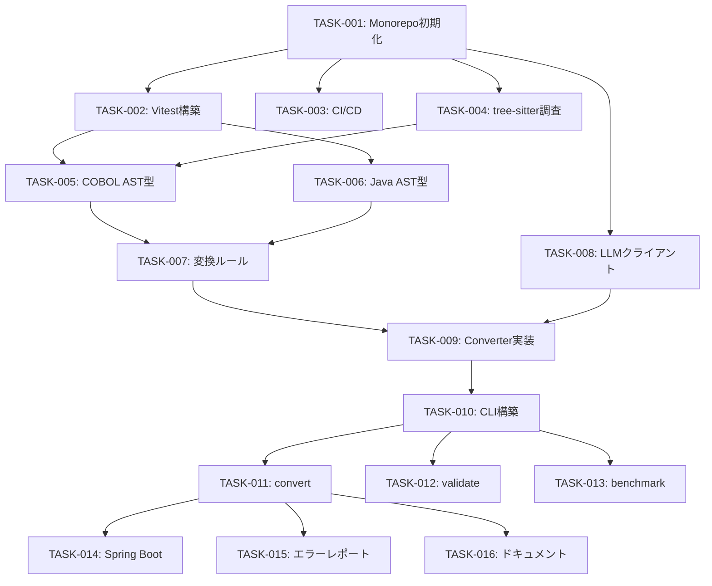

# Implementation Tasks

**Feature**: cobol-java-converter  
**Created**: 2025-12-11  
**Workflow**: MUSUBI SDD Article III (Test-First Imperative)

---

## Phase 1: Foundation (Sprint 1-2)

### TASK-001: Monorepo 初期化
**Requirement**: N/A (Infrastructure)  
**Priority**: P0 - Critical  
**Estimate**: 2h

**Description**:
pnpm workspacesでMonorepo構造を初期化

**Deliverables**:
- [ ] `pnpm-workspace.yaml` 作成
- [ ] `packages/core/package.json` 作成
- [ ] `packages/cli/package.json` 作成
- [ ] `packages/parser/package.json` 作成
- [ ] Root `package.json` 作成
- [ ] `tsconfig.json` (共通設定)
- [ ] `.eslintrc.js` + `.prettierrc`
- [ ] `.gitignore` 更新

**Acceptance Criteria**:
```bash
pnpm install  # エラーなく完了
pnpm -r build # 全パッケージビルド成功（空でも）
```

---

### TASK-002: Vitest テスト基盤構築
**Requirement**: Article III (Test-First)  
**Priority**: P0 - Critical  
**Estimate**: 1h

**Description**:
Vitestによるテスト環境のセットアップ

**Deliverables**:
- [ ] `vitest.config.ts` 作成
- [ ] `packages/core/__tests__/` ディレクトリ作成
- [ ] サンプルテスト作成（スモークテスト）
- [ ] `pnpm test` スクリプト追加

**Acceptance Criteria**:
```bash
pnpm test  # テスト実行成功
```

---

### TASK-003: CI/CD パイプライン構築
**Requirement**: N/A (Infrastructure)  
**Priority**: P1 - High  
**Estimate**: 2h

**Description**:
GitHub Actionsでテスト・ビルド・リントを自動化

**Deliverables**:
- [ ] `.github/workflows/ci.yml` 作成
- [ ] テスト実行ステップ
- [ ] ESLintチェックステップ
- [ ] ビルドステップ

**Acceptance Criteria**:
- PRでCIが自動実行される
- テスト失敗時にマージブロック

---

## Phase 2: Parser (Sprint 2-3)

### TASK-004: tree-sitter-cobol 調査・セットアップ
**Requirement**: REQ-CVT-001  
**Priority**: P0 - Critical  
**Estimate**: 4h

**Description**:
tree-sitter-cobol文法の調査とプロジェクトへの統合

**Deliverables**:
- [ ] 既存のtree-sitter-cobol文法評価
- [ ] `packages/parser/` Rust プロジェクト初期化
- [ ] napi-rs バインディング設定
- [ ] サンプルCOBOLのパース成功

**Acceptance Criteria**:
```typescript
const parser = new CobolParser();
const ast = parser.parse('IDENTIFICATION DIVISION...');
expect(ast.type).toBe('program');
```

---

### TASK-005: COBOL AST型定義
**Requirement**: REQ-CVT-001, REQ-CVT-002  
**Priority**: P0 - Critical  
**Estimate**: 4h

**Description**:
TypeScriptでCOBOL ASTの型定義を作成

**Deliverables**:
- [ ] `packages/core/src/ast/cobol.ts` 型定義
- [ ] IDENTIFICATION DIVISION ノード
- [ ] DATA DIVISION ノード
- [ ] PROCEDURE DIVISION ノード
- [ ] 各DIVISIONのセクション・句

**Acceptance Criteria**:
- 型定義がCOBOL-85仕様をカバー
- tscheck通過

---

### TASK-006: Java AST型定義
**Requirement**: REQ-CVT-002  
**Priority**: P0 - Critical  
**Estimate**: 3h

**Description**:
TypeScriptでJava ASTの型定義を作成

**Deliverables**:
- [ ] `packages/core/src/ast/java.ts` 型定義
- [ ] Package/Import ノード
- [ ] Class/Interface ノード
- [ ] Method/Field ノード
- [ ] Statement/Expression ノード

**Acceptance Criteria**:
- 型定義がJava 17機能をカバー
- tscheck通過

---

## Phase 3: Transformation Core (Sprint 3-4)

### TASK-007: 変換マッピングルール実装
**Requirement**: REQ-CVT-002, REQ-CVT-004  
**Priority**: P0 - Critical  
**Estimate**: 8h

**Description**:
COBOLからJavaへの基本変換ルールを実装

**Deliverables**:
- [ ] `packages/core/src/transform/rules.ts`
- [ ] データ型マッピング（PIC → Java型）
- [ ] PERFORM → メソッド呼び出し
- [ ] MOVE → 代入文
- [ ] IF/EVALUATE → if/switch
- [ ] COMPUTE → 算術式

**Test Cases** (Test-First):
```typescript
it('maps PIC 9(5) to int', () => {
  expect(mapDataType('PIC 9(5)')).toBe('int');
});

it('transforms PERFORM to method call', () => {
  const cobol = 'PERFORM CALCULATE-TAX';
  expect(transform(cobol)).toContain('calculateTax()');
});
```

---

### TASK-008: LLMクライアント実装
**Requirement**: REQ-CVT-005, REQ-OPT-002  
**Priority**: P1 - High  
**Estimate**: 4h

**Description**:
LLMプロバイダー抽象化レイヤーの実装

**Deliverables**:
- [ ] `packages/core/src/llm/client.ts` インターフェース
- [ ] `packages/core/src/llm/openai.ts` 実装
- [ ] `packages/core/src/llm/claude.ts` 実装
- [ ] `packages/core/src/llm/ollama.ts` 実装
- [ ] `packages/core/src/llm/noop.ts` 実装（LLMなし）

**Acceptance Criteria**:
```typescript
const client = createLLMClient({ provider: 'openai', apiKey: '...' });
const result = await client.complete('Translate COBOL to Java: ...');
```

---

### TASK-009: Converter メイン実装
**Requirement**: REQ-CVT-001, REQ-CVT-002, REQ-CVT-003  
**Priority**: P0 - Critical  
**Estimate**: 8h

**Description**:
コア変換エンジンの実装

**Deliverables**:
- [ ] `packages/core/src/converter.ts` メイン
- [ ] `parse()` - COBOL解析
- [ ] `analyze()` - セマンティック解析
- [ ] `transform()` - AST変換
- [ ] `generate()` - Javaコード生成

**Acceptance Criteria**:
```typescript
const result = await convert(cobolSource, { llmProvider: 'none' });
expect(result.java).toContain('public class');
expect(result.errors).toHaveLength(0);
```

---

## Phase 4: CLI (Sprint 4-5)

### TASK-010: CLI フレームワーク構築
**Requirement**: Article II (CLI Mandate)  
**Priority**: P0 - Critical  
**Estimate**: 3h

**Description**:
CommanderまたはCliffyによるCLI構築

**Deliverables**:
- [ ] `packages/cli/src/index.ts` エントリポイント
- [ ] `packages/cli/bin/cobol2java.ts` 実行ファイル
- [ ] バージョン表示 (`--version`)
- [ ] ヘルプ表示 (`--help`)

**Acceptance Criteria**:
```bash
cobol2java --version  # 0.1.0
cobol2java --help     # ヘルプ表示
```

---

### TASK-011: convert コマンド実装
**Requirement**: REQ-CVT-001, REQ-OPT-001  
**Priority**: P0 - Critical  
**Estimate**: 4h

**Description**:
ファイル/ディレクトリ変換コマンドの実装

**Deliverables**:
- [ ] `cobol2java convert <input>` 実装
- [ ] `-o, --output` オプション
- [ ] `--llm` プロバイダー選択
- [ ] `--package` パッケージ名指定
- [ ] `--java-version` ターゲットJavaバージョン

**Acceptance Criteria**:
```bash
cobol2java convert sample.cbl -o output/
# output/Sample.java が生成される
```

---

### TASK-012: validate コマンド実装
**Requirement**: REQ-ERR-001  
**Priority**: P1 - High  
**Estimate**: 2h

**Description**:
COBOL構文検証コマンドの実装

**Deliverables**:
- [ ] `cobol2java validate <input>` 実装
- [ ] 構文エラー表示
- [ ] exit code (0=OK, 1=エラー)

**Acceptance Criteria**:
```bash
cobol2java validate valid.cbl    # exit 0
cobol2java validate invalid.cbl  # exit 1, エラー表示
```

---

### TASK-013: benchmark コマンド実装
**Requirement**: N/A (Quality)  
**Priority**: P2 - Medium  
**Estimate**: 4h

**Description**:
COBOLEvalベンチマーク実行コマンドの実装

**Deliverables**:
- [ ] `cobol2java benchmark` 実装
- [ ] COBOLEval読み込み
- [ ] Pass@k計算
- [ ] 結果レポート出力

**Acceptance Criteria**:
```bash
cobol2java benchmark --dataset storage/cobol-samples/COBOLEval/
# Pass@1: 45%, Pass@5: 62%, ...
```

---

## Phase 5: Integration & Polish (Sprint 5-6)

### TASK-014: Spring Boot オプション対応
**Requirement**: REQ-OPT-002  
**Priority**: P2 - Medium  
**Estimate**: 4h

**Description**:
Spring Boot形式での出力対応

**Deliverables**:
- [ ] `--spring-boot` オプション追加
- [ ] `@Service` / `@Repository` アノテーション生成
- [ ] `application.properties` テンプレート

---

### TASK-015: エラーレポート改善
**Requirement**: REQ-ERR-001, REQ-ERR-002  
**Priority**: P1 - High  
**Estimate**: 3h

**Description**:
詳細なエラーレポート機能の実装

**Deliverables**:
- [ ] エラー位置（行番号・列番号）表示
- [ ] エラーコード体系
- [ ] 修正サジェスト（可能な場合）
- [ ] JSON形式出力（`--format json`）

---

### TASK-016: ドキュメント整備
**Requirement**: N/A (Documentation)  
**Priority**: P1 - High  
**Estimate**: 4h

**Description**:
ユーザードキュメント・開発者ドキュメントの作成

**Deliverables**:
- [ ] `README.md` 更新（使い方）
- [ ] `docs/getting-started.md`
- [ ] `docs/api.md`
- [ ] `docs/contributing.md`

---

## タスク依存関係



---

## スプリント計画

| Sprint | タスク | 目標 |
|--------|--------|------|
| Sprint 1 | T001, T002, T003 | 開発環境構築完了 |
| Sprint 2 | T004, T005, T006 | パーサー・型定義完了 |
| Sprint 3 | T007, T008 | 変換ルール・LLM連携完了 |
| Sprint 4 | T009, T010, T011 | Converter・CLI基本動作 |
| Sprint 5 | T012, T013, T014 | CLI拡張・ベンチマーク |
| Sprint 6 | T015, T016 | 品質向上・リリース準備 |

---

## Traceability Matrix

| Task | Requirements | Design | Test |
|------|--------------|--------|------|
| TASK-007 | REQ-CVT-002, REQ-CVT-004 | Container: Core | transform.test.ts |
| TASK-008 | REQ-CVT-005, REQ-OPT-002 | Component: LLM | llm.test.ts |
| TASK-009 | REQ-CVT-001~003 | Container: Core | converter.test.ts |
| TASK-011 | REQ-OPT-001 | Container: CLI | cli.test.ts |
| TASK-012 | REQ-ERR-001 | Container: CLI | validate.test.ts |

---

*このドキュメントはMUSUBI SDD Article III (Test-First Imperative) に準拠しています*
